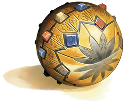

=**AT-88**= 

**AT-88 is a "Pike of the line" One of the constructs created by the master Gnomish artificers. Each Pike cost hundreds of thousands of gold pieces to create. Dragon slayers and warriors of epic renown they defended the Gnomish people from all dangers. After the fall of the Gnomish nation AT-88 was buried in silt for 1000 years, corrosion and magical decay did massive damage o AT-88's systems. AT-88 is currently operating at 20% of normal capability.**

**AT-88's personality is currently offline, the unit is operating under very basic orders and programming and seems hardly any more "real" than a well designed golem. In this state AT-88 pursues the goals of Gnomish preservation with amoral automatic efficiency.**
**Whether or not AT-88's personality can be restored is unknown.**

**Marty:**

**Marty is a Docent, a magical sphere roughly the size of a grapefruit, embued with the souls and memory of a Gnome of "Renownd Wisdom" In life Marty was a famous gem merchant, who was possibly not the shining example of wisdom normally selected for such honor, but he was famed for never once in his life paying retail price for anything. Like AT-88 Marty is badly damaged, significant portions of his memory are missing, but he may prove easier (and cheaper) to repair than AT-88.**

===**[AT-88 Diagnostic Log](AT-88 Diagnostic Log.html)**=== 
**[AT-88 Diagnostic Log 2](AT-88 Diagnostic Log 2.html)**
